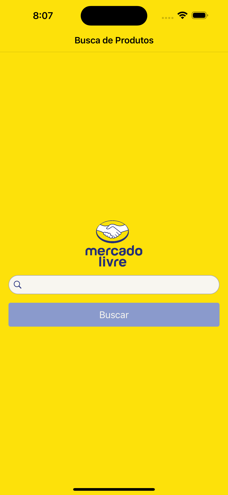
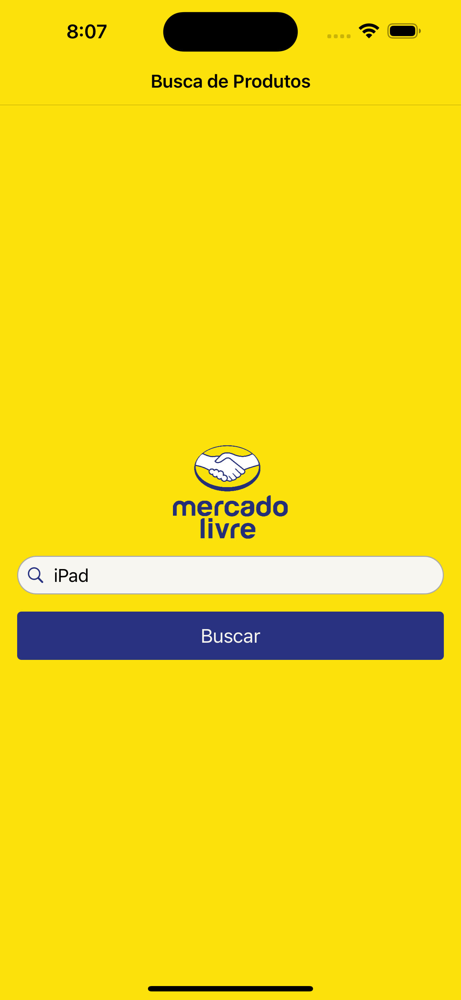

# 📱 Desafio Técnico Desenvolvedor iOS - Mercado Livre

Olá, me chamo Gáudio e estou muito feliz por poder particiar desta etapa de avaliação técnica para a posição de iOS Engineer no Mercado Livre. Abaixo, trago mais detalhes sobre o projeto, decisões, tomadas de decisão e destaco as principais features implementadas.

## 📋 Pré-requisitos atendidos do desafio
- Construção de um App com:
    - **Tela com Barra de Busca**;
    - **Tela com listagem dos produtos da busca;**
    - **Tela de detalhe do produto;**
    - **UI Responsiva com rotação**
    - **Aplicação de Logs e tratavia de erros inesperados**
    - **Feedbacks para o usuário via Alertas**

## 🧭 Pontos a serem levados em consideração na avaliação
- Seleção dos padrões de design.
- Guidelines oficiais da plataforma.
- Como garantir a qualidade do projeto (ex: testes unitários).
- Design otimizado de layouts.
- Uso de la memoria (ex: Memory Leaks).
- Legibilidade do código e documentação.
- Experiência do usuário.
- Permissões do sistema operacional solicitadas ao usuário.

## ⚙️ Decisões Técnicas
- Como o endpoint **/sites/$SITE_ID/search?nickname=$NICKNAME** está retornando status code **403**, foi decidido seguir com os dados de busca mockados para que a experiência do desafio fosse preservada.
- A camada de Network foi desenvolvida, porém, não foi o foco do desafio, uma vez que não seria possível conseguir os IDs para acessar a API de detalhe do produto (fluxo final da navegação de busca).

## ✏️ Testes Unitários
- Ferramenta utilizada: **XCTest**
- Funções testadas: camada de lógica de negócio do ViewModel de busca do aplicativo.

## 📍 Features implementadas
- ✅ **Localizables**: o aplicativo foi totalmente localizado para 3 idiomas (1. Português 2. Inglês 3. Espanhol) para proporcionar uma experiência de usuário mais inclusiva para outras línguas.
- ✅ **Camada de Network Nativa**: o projeto comporta uma estrutura nativa para realização de requisições para APIs através do **URLSession** do Swift para maior personalização das chamadas e tratativas de Erro dos serviços.
- ✅ **Tratamento de Erros**: o foco foi tratar e dar o retorno visual para o usuário sobre o que houve de problema durante a requisição a API e experiência do usuário na barra de busca para evitar envio desncessário sem caracters escritos ao buscar, desabilitando o botão de envio e só habilitando quando houver texto para busca.

## 🔨 Tecnologias aplicadas
- Swift (UIKit);
- Target Mínimo do iOS: 14;
- Técnica: View Code;
- Arquitetura: MVVM;
- Versão do XCode: 15.0.1;
- Gerenciador de dependências utilizado: Swift Package Manager(SPM);
- Bibliotecas externas utilizadas:
    - SnapKit [para otimização da contrução das contraints e melhor leitura do código];
    - KingFisher [para otimizar o carregamento de imagens];

## 📲 Telas

  
  
  
  

